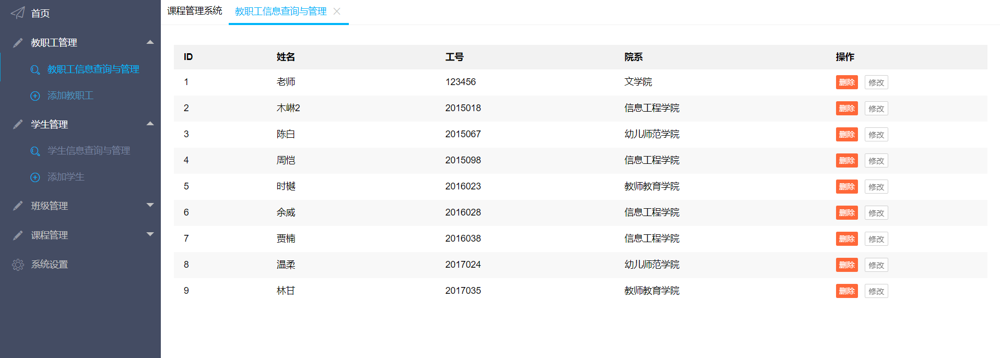
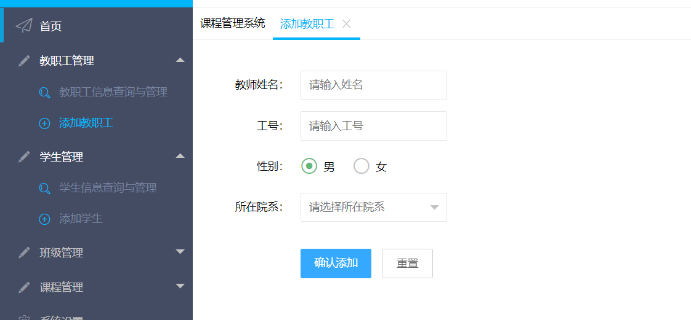
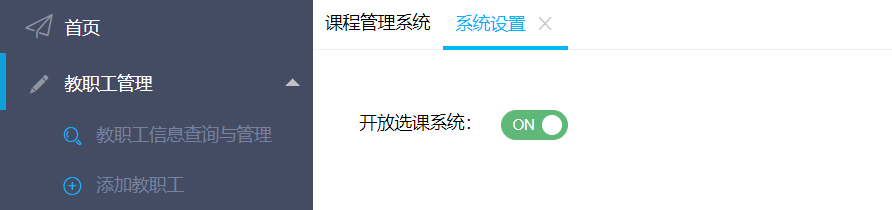
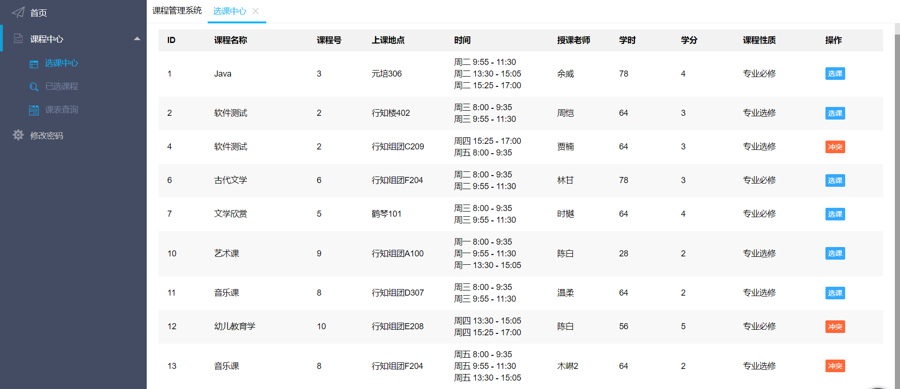
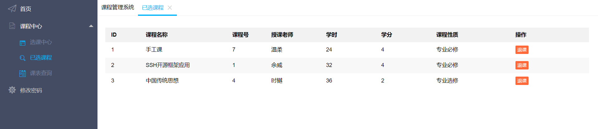
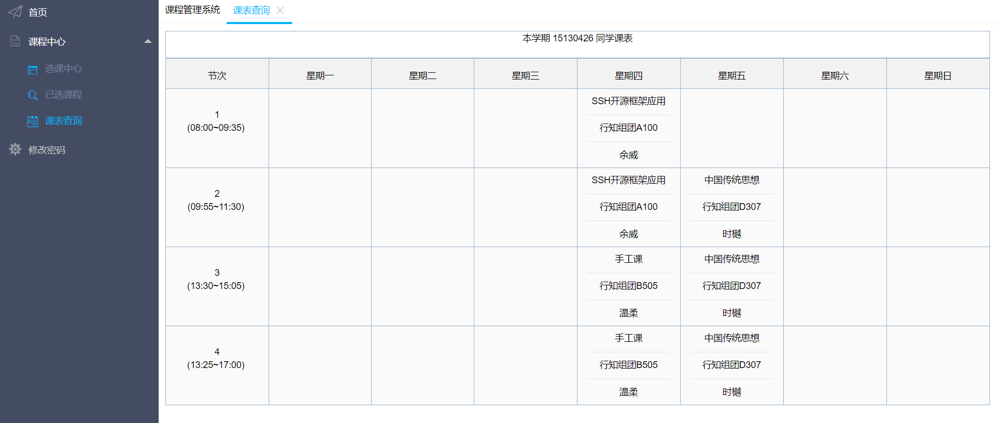

# Course-System-Back
基于SSH的学生选课系统，采用前后端分离，这是后端项目

 
 
 
 
 

- 个人博客地址：https://www.ltysyn.cn/?p=164
- csdn 地址：https://blog.csdn.net/ansellyy/article/details/80998551

## 项目开发环境

- Spring 5.0.6.RELEASE
- Struts 2.5.16
- Hibernate 5.3.0.Final
- LayUI
- jQuery 3.3.1

## 项目概述

> 该项目采用前后端分离技术，前端使用 LayUI 以及 JQuery，跨域请求后端 Rest API；  
> 后端使用 SSH 框架开发，返回 JSON 数据给请求。  
> 项目主要实现 1. 学生选课退课、查询本学期课表；2. 教师查询本学期课程、本学期课表；3. 管理员添加学生和教师信息、添加本学期排课情况、关闭|开放选课系统  
> 项目核心考虑业务包括：1. 学生选课：该课程是否被选过、该门课程是否已选、该时间段是否有课；2. 管理员添加课程：选择课程授课老师后，仅显示该教师的空余时间供管理员进行选择

## 功能模块描述

### 管理员

#### 教职工管理

- 教职工信息查询与管理：允许管理员进行教职工信息的查询与删除

- 添加教职工：添加教职工信息

#### 学生管理

- 学生信息查询与管理：允许管理员进行学生信息的查询与删除
- 添加学生：添加学生信息

#### 班级管理

- 班级信息查询与管理：允许管理员进行班级信息的查询与删除
- 添加班级：添加班级信息

#### 课程管理

- 课程信息查询与管理：允许管理员进行课程信息的查询与删除
- 添加课程：添加课程信息

#### 系统设置

- 允许管理员对选课中心进行开放和关闭

### 学生

#### 课程中心

**选课中心**：在选课系统开放期间，允许学生进行选课；

> 系统会对该学生的已选课程进行判断，将会隐藏某门已选课程，并禁选时间冲突的课程

**已选课程**：允许学生查看已选课程，并进行退选操作

**课表查询**：允许学生查看本学期课表

#### 修改密码

- 学生可以对自己的密码进行修改

### 教师

> 教师功能同学生类似
